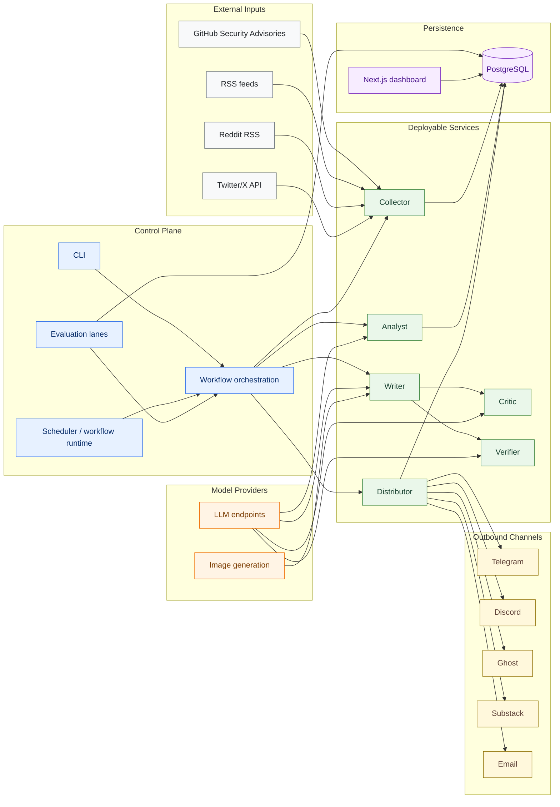
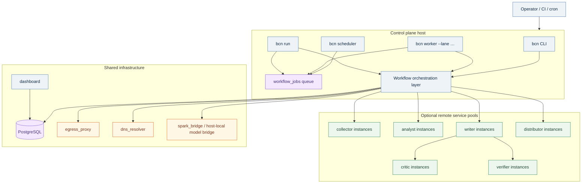
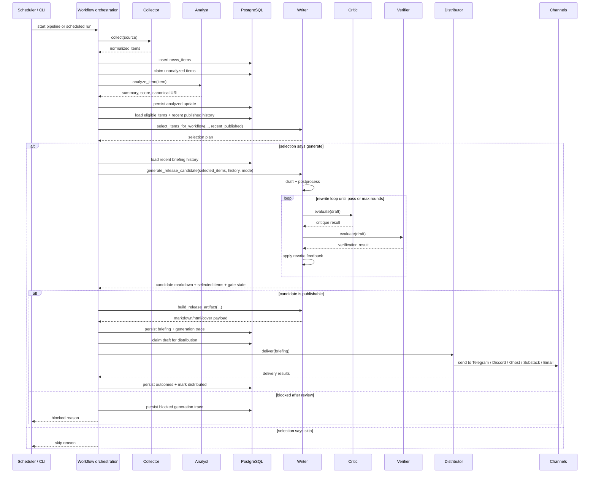

# Architecture

Broken Cloud News is structured as a control plane that owns workflow state and orchestration, plus deployable services that can run in-process or behind internal HTTP endpoints.

The diagrams below are intended to reflect the current codebase and default Compose topology, not an aspirational future shape.

## Logical Architecture

## Deployment Topology

## Briefing Execution Flow

## Current Runtime Model

### Control Plane

The control plane owns:

- scheduling
- scheduled workflow definitions
- workflow orchestration
- retry and stale-claim recovery
- database state transitions
- generation trace persistence
- human review and evaluation orchestration
- retrieval of novelty/history context for downstream services

The control plane lives under `bcn/workflows` and is the only layer that mutates workflow state.

Scheduled jobs are defined through `bcn/workflows/catalog.py`. Each definition declares:

- workflow id
- trigger builder
- logical steps
  - component
  - operation
  - args
- optional enablement predicate
- queue lane / priority / retry policy
- optional deadline budget

The scheduler no longer executes those workflows inline. It enqueues durable jobs into `workflow_jobs`, and lane-scoped workers lease and execute them. Execution is still step-driven through `bcn/workflows/execution.py`, which dispatches typed workflow steps instead of hardcoding one executor per scheduled workflow.

### Deployable Services

Deployable services live under `bcn/services` and are callable either:

- directly in-process through the service registry
- remotely over internal JSON/HTTP endpoints

Current service set:

| Service | Default port | Canonical endpoint(s) | Responsibility |
|---|---:|---|---|
| `writer` | `8081` | `/v1/trace-metadata`, `/v1/select-items-for-workflow`, `/v1/evaluate-existing-markdown`, `/v1/generate-release-candidate`, `/v1/build-release-artifact`, `/v1/simulate-briefing-body` | selection planning, novelty-aware draft generation, artifact rendering, simulation |
| `critic` | `8082` | `/v1/evaluate` | editorial and quality evaluation |
| `verifier` | `8083` | `/v1/evaluate` | deterministic and LLM-backed factual verification |
| `collector` | `8084` | `/v1/collect` | source collection, normalization, and bounded enrichment |
| `analyst` | `8085` | `/v1/analyze-item` | scoring, summarization, tagging, canonicalization |
| `distributor` | `8086` | `/v1/deliver` | outbound delivery to Telegram, Discord, Ghost, Substack, and email |

Every service also exposes `/v1/healthz`.

Internal service structure:

- `writer` is a facade over `selection`, `drafting`, `review`, `postprocess`, `rendering`, and `covers`
- `collector` is a facade over source adapters in `bcn/services/collector/{ghsa,rss,reddit,twitter}.py`
- `critic` and `verifier` are review services typically called by the writer, not directly by the workflow layer
- `distributor` is a facade over channel-specific adapters in `bcn/distributors/`

Service boundary rule:

- the control plane loads workflow state and history from PostgreSQL
- services operate on explicit request payloads
- novelty/repetition policy lives in writer and critic logic, not in the control plane

Transport characteristics:

- ASGI HTTP server
- one app-scoped component instance per process, created at startup and closed at shutdown
- JSON request/response payloads
- optional shared auth token via `X-BCN-Service-Token` or `Authorization: Bearer ...`
- service contracts defined in `bcn/contracts`

### Persistence Layer

The persistence layer lives under `bcn/persistence` and is split by domain:

- `news_items.py`
- `briefings.py`
- `training.py`
- `evaluation.py`
- `collection_sources.py`
- `newsletter.py`
- `history.py`
- `runtime.py`
- `optimization.py`

PostgreSQL is the system of record for:

- collected and analyzed items
- briefing lifecycle state
- delivery outcomes
- human reviews
- simulation, benchmark, and shadow runs
- source-review registry state
- optimization runs and candidates

### Evaluation Stack

The evaluation layer lives under `bcn/evaluation` and reuses the same service contracts as live execution.

It supports:

- historical simulation
- benchmark packs
- challenger evaluations
- shadow runs
- comparative scoring across stored runs

The dashboard in `dashboard/` reads persisted evaluation data from PostgreSQL.

## Repository Layout

| Path | Purpose |
|---|---|
| `bcn/workflows/` | control-plane orchestration, scheduled job catalog, and workflow runtimes |
| `bcn/services/` | deployable processing services |
| `bcn/contracts/` | typed cross-service payloads and protocols |
| `bcn/persistence/` | database access layer |
| `bcn/transports/http/` | ASGI servers and remote clients |
| `bcn/evaluation/` | simulation, benchmark, and shadow lanes |
| `dashboard/` | Next.js evaluation dashboard |
| `postgres/migrations/` | schema migrations |
| `infra/` | proxy, DNS, and bridge config used by Compose |
