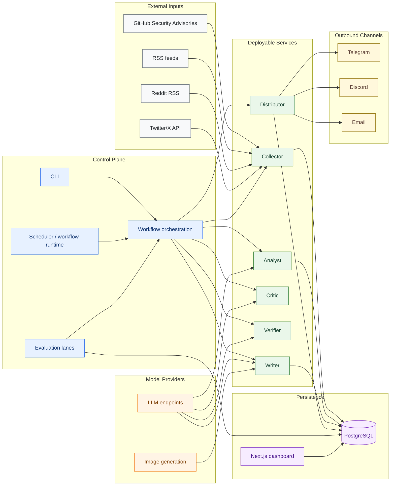
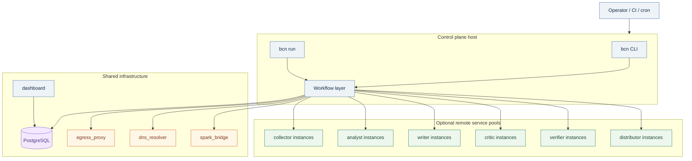
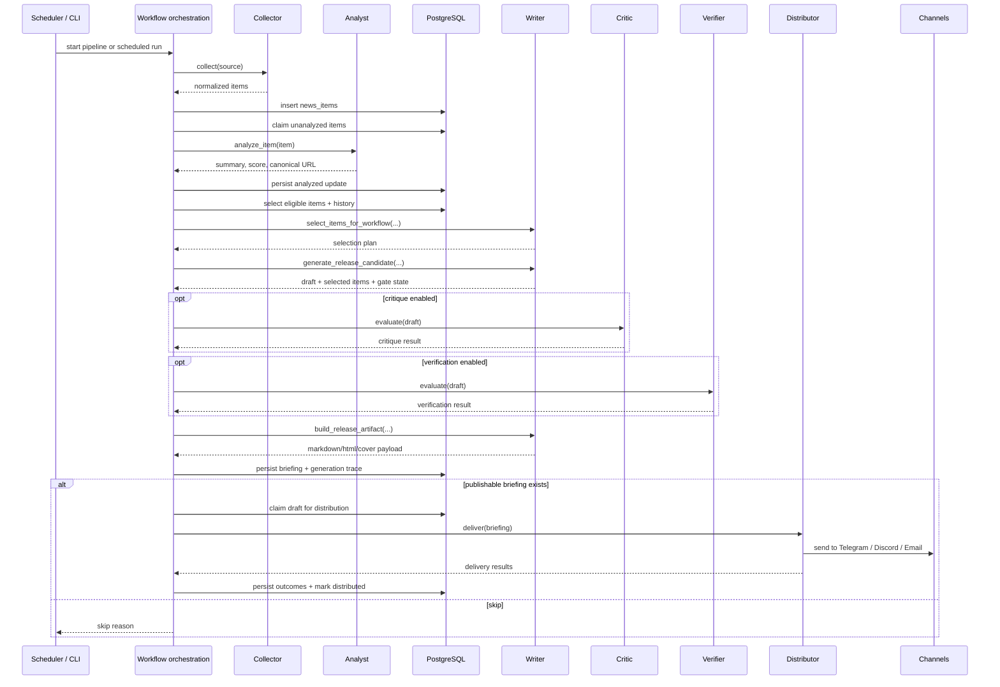

<p align="center">
  
</p>

Broken Cloud News is a cloud-security briefing platform with a central control plane, a split persistence layer, and deployable processing services that can run either in-process or behind internal HTTP endpoints.

It collects security signals from GHSA, RSS, Reddit, and Twitter/X, analyzes and ranks them, generates briefings and newsletters, evaluates draft quality, distributes approved output, and stores evaluation and review data for replay and benchmarking.

## System Overview

### Logical Architecture



### Deployment Topology



### Briefing Execution Flow



## Current Runtime Model

### Control plane

The control plane owns:

- scheduling
- workflow orchestration
- retry and stale-claim recovery
- database state transitions
- generation trace persistence
- human review and evaluation orchestration

The control plane lives under `bcn/workflows` and is the only layer that mutates workflow state.

### Deployable services

The deployable services live under `bcn/services` and are designed to be callable either:

- directly in-process through the service registry
- remotely over internal JSON/HTTP endpoints

Current service set:

| Service | Default port | Canonical endpoint(s) | Responsibility |
|---|---:|---|---|
| `writer` | `8081` | `/v1/trace-metadata`, `/v1/select-items-for-workflow`, `/v1/evaluate-existing-markdown`, `/v1/generate-release-candidate`, `/v1/build-release-artifact`, `/v1/simulate-briefing-body` | selection planning, draft generation, artifact rendering, simulation |
| `critic` | `8082` | `/v1/evaluate` | editorial and quality evaluation |
| `verifier` | `8083` | `/v1/evaluate` | deterministic and LLM-backed factual verification |
| `collector` | `8084` | `/v1/collect` | source collection and normalization |
| `analyst` | `8085` | `/v1/analyze-item` | scoring, summarization, tagging, canonicalization |
| `distributor` | `8086` | `/v1/deliver` | outbound delivery to Telegram, Discord, and email |

Every service also exposes `/v1/healthz`.

Transport characteristics:

- ASGI HTTP server
- JSON request/response payloads
- optional shared auth token via `X-BCN-Service-Token` or `Authorization: Bearer ...`
- service contracts defined in `bcn/contracts`

### Persistence layer

The persistence layer lives under `bcn/persistence` and is split by domain:

- `news_items.py`
- `briefings.py`
- `training.py`
- `evaluation.py`
- `collection_sources.py`
- `newsletter.py`
- `history.py`
- `runtime.py`

PostgreSQL is the system of record for:

- collected and analyzed items
- briefing lifecycle state
- delivery outcomes
- human reviews
- simulation, benchmark, and shadow runs
- source-review registry state

### Evaluation stack

The evaluation layer lives under `bcn/evaluation` and reuses the same service contracts as live execution.

It supports:

- historical simulation
- benchmark packs
- challenger evaluations
- shadow runs
- comparative scoring across stored runs

The dashboard in `dashboard/` reads persisted evaluation data from PostgreSQL.

## Repository Layout

| Path | Purpose |
|---|---|
| `bcn/workflows/` | control-plane orchestration and scheduled jobs |
| `bcn/services/` | deployable processing services |
| `bcn/contracts/` | typed cross-service payloads and protocols |
| `bcn/persistence/` | database access layer |
| `bcn/transports/http/` | ASGI servers and remote clients |
| `bcn/evaluation/` | simulation, benchmark, and shadow lanes |
| `dashboard/` | Next.js evaluation dashboard |
| `postgres/migrations/` | schema migrations |
| `infra/` | proxy, DNS, and bridge config used by Compose |

## Running The System

### Prerequisites

- Python 3.12+
- Docker and Docker Compose
- PostgreSQL
- configured LLM endpoints
- configured channel credentials if distribution is enabled

### Local setup

```bash
git clone https://github.com/andreyka/broken-cloud-news.git
cd broken-cloud-news
./setup.sh
```

### Start the default stack

```bash
docker compose up -d
```

Current Compose services:

- `bcn`
- `postgres`
- `dashboard`
- `egress_proxy`
- `dns_resolver`
- `spark_bridge`

Default exposed ports:

- `3007` -> dashboard
- `5432` -> PostgreSQL
- `9001`-`9006` -> BCN container published ports

### CLI entrypoints

Core workflow commands:

```bash
bcn collect --source all
bcn analyze
bcn write --mode regular_daily_briefing
bcn distribute --mode regular_daily_briefing
bcn workflow-run --mode ad_hoc
bcn pipeline --mode regular_daily_briefing
bcn run
```

Evaluation and review commands:

```bash
bcn simulate --limit 30
bcn benchmark-pack --output benchmark_pack.json
bcn benchmark --cases benchmark_pack.json
bcn shadow --candidate-overrides challenger.json --store-db
bcn review --decision accept
bcn review-queue --only-unreviewed
bcn export-training --output-dir training_export
```

Service hosting:

```bash
bcn serve writer
bcn serve critic
bcn serve verifier
bcn serve collector
bcn serve analyst
bcn serve distributor
```

## Split Deployment

The control plane can keep workflow ownership while calling remote service pools.

Example layout:

- host A: `bcn run` plus PostgreSQL access
- host B: `bcn serve writer`
- host C: `bcn serve critic`
- host D: `bcn serve verifier`
- host E: `bcn serve collector`
- host F: `bcn serve analyst`
- host G: `bcn serve distributor`

Typical control-plane environment:

```bash
BCN_WRITER_SERVICE_URL=http://writer.internal:8081
BCN_CRITIC_SERVICE_URL=http://critic.internal:8082
BCN_VERIFIER_SERVICE_URL=http://verifier.internal:8083
BCN_COLLECTOR_SERVICE_URL=http://collector.internal:8084
BCN_ANALYST_SERVICE_URL=http://analyst.internal:8085
BCN_DISTRIBUTOR_SERVICE_URL=http://distributor.internal:8086
BCN_SERVICE_AUTH_TOKEN=shared-internal-token
```

Service processes load component-scoped settings rather than the full control-plane settings surface.

## Source And Output Coverage

### Inputs

- GitHub Security Advisories
- RSS feeds
- Reddit RSS
- Twitter/X API

### Outputs

- Telegram
- Discord
- Email newsletters

## Security And Networking

The default Compose topology includes:

- an internal Squid proxy for outbound web traffic
- an internal CoreDNS resolver
- an internal bridge for the Spark/Qwen endpoint

This keeps the main `bcn` container on an internal network while still allowing controlled outbound access and model access paths.

## Database Lifecycle

Run migrations with:

```bash
bcn db-migrate
```

Preview pending migrations with:

```bash
bcn db-migrate --dry-run
```
