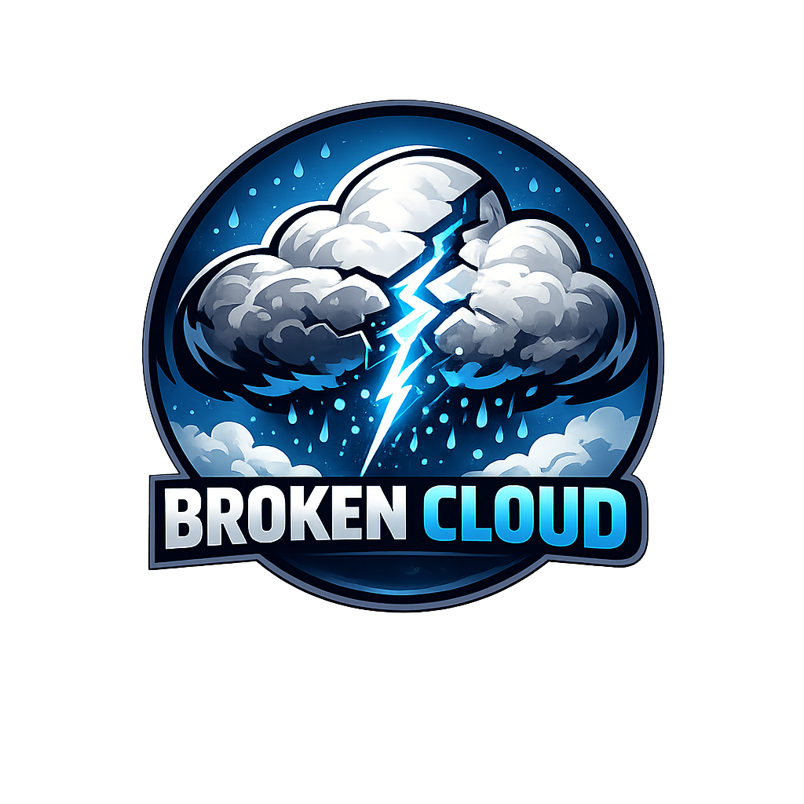
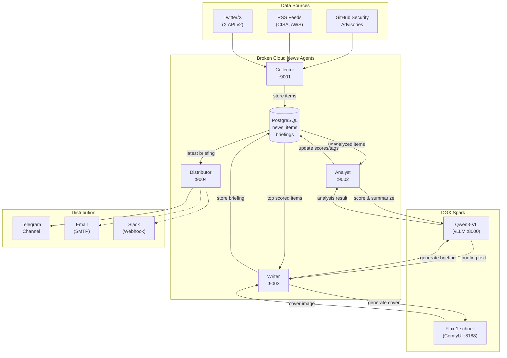

<p align="center">
  
</p>

---

## Architecture

Four A2A agents work together, coordinated by an internal scheduler. Each agent runs as an independent HTTP server using the Google Agent-to-Agent protocol.



### Agent Details

| Agent | Port | Trigger | Role |
|-------|------|---------|------|
| **Collector** | 9001 | Every 2-6h | Fetches GHSA, RSS (CISA + AWS), Twitter/X via API v2 |
| **Analyst** | 9002 | Every 15m | Scores relevance (1-10) and summarizes via Qwen LLM |
| **Writer** | 9003 | Daily 9:00 | Generates briefing + Flux cover image from top items |
| **Distributor** | 9004 | After Writer | Sends photo+caption to Telegram channel |

All agents communicate via the **A2A JSON-RPC protocol** and share state through PostgreSQL. The scheduler orchestrates the pipeline automatically in daemon mode.

---

## Quick Start

### Prerequisites
- Python 3.12+
- Docker & Docker Compose
- NVIDIA DGX / GPU server with Qwen + ComfyUI deployed (see [AI Infrastructure](#ai-infrastructure))

### Setup
```bash
git clone https://github.com/andreyka/broken-cloud-news.git
cd broken-cloud-news

# Start PostgreSQL
docker compose up -d postgres

# Install Python package
pip install -e .
playwright install chromium

# Configure
cp .env.example .env
# Edit .env with your tokens and endpoints
```

### Run

**CLI commands:**
```bash
bcn collect              # Collect from all sources
bcn collect -s ghsa      # Collect GHSA only
bcn analyze              # Analyze new items with LLM
bcn write                # Generate briefing + cover image
bcn distribute           # Send to configured channels
bcn pipeline             # Full pipeline: collect -> analyze -> write -> distribute
```

**Daemon mode** (all agents + scheduler):
```bash
bcn run
```

**Docker (full stack):**
```bash
docker compose up -d
```

---

## Configuration

All settings via environment variables with `BCN_` prefix. See `.env.example` for the full list.

| Variable | Default | Description |
|----------|---------|-------------|
| `BCN_DATABASE_URL` | `postgresql://...` | PostgreSQL connection string |
| `BCN_LLM_BASE_URL` | `http://host.docker.internal:8000/v1` | Qwen API endpoint |
| `BCN_COMFYUI_URL` | `http://host.docker.internal:8188` | ComfyUI Flux endpoint |
| `BCN_GITHUB_TOKEN` | - | GitHub API token for GHSA |
| `BCN_TWITTER_BEARER_TOKEN` | - | X API v2 bearer token |
| `BCN_TELEGRAM_BOT_TOKEN` | - | Telegram bot token |
| `BCN_TELEGRAM_CHAT_ID` | - | Telegram channel chat ID |
| `BCN_RELEVANCE_THRESHOLD` | `7` | Min score (1-10) to include in briefing |

---

## AI Infrastructure (DGX Spark)

### 1. Qwen3-VL (LLM Inference)

Runs as an OpenAI-compatible API via **vLLM**:

```bash
docker run --rm -it \
    --gpus all \
    --ipc=host \
    --shm-size=32g \
    -p 8000:8000 \
    -v ~/.cache/huggingface:/root/.cache/huggingface \
    nvcr.io/nvidia/vllm:25.12.post1-py3 \
    vllm serve Qwen/Qwen3-VL-30B-A3B-Instruct-FP8 \
    --host 0.0.0.0 --port 8000 \
    --trust-remote-code \
    --dtype auto \
    --gpu-memory-utilization 0.55 \
    --max-model-len 16384
```

### 2. Flux.1-schnell (Cover Image Generation)

Runs **ComfyUI** with Flux model:

```bash
# Build image
docker build -t comfyui:arm64-cuda -f Dockerfile.comfyui .

# Download model
mkdir -p ~/comfyui/models/checkpoints
wget -O ~/comfyui/models/checkpoints/flux1-schnell.safetensors \
  https://huggingface.co/black-forest-labs/FLUX.1-schnell/resolve/main/flux1-schnell.safetensors

# Run
docker run --rm -it \
  --gpus all --shm-size=32g \
  -p 8188:8188 \
  -v ~/comfyui/models:/opt/ComfyUI/models \
  -v ~/comfyui/output:/opt/ComfyUI/output \
  comfyui:arm64-cuda
```

---

## A2A Protocol

Each agent exposes a standard Google A2A interface:
- Agent Card at `GET /.well-known/agent.json`
- Message handling via JSON-RPC

```python
from a2a.client import A2AClient
import httpx

async with httpx.AsyncClient() as http:
    client = await A2AClient.get_client_from_agent_card_url(
        http, "http://localhost:9001"
    )
    response = await client.send_message(request)
```

---

## Project Structure
```
bcn/
  cli.py              CLI commands + daemon scheduler
  config.py           Pydantic Settings (env vars)
  db.py               asyncpg database layer
  models.py           Pydantic data models
  llm.py              Qwen LLM client (analysis + briefing)
  comfyui.py          ComfyUI Flux client (cover images)
  scraper.py          Playwright headless Chromium scraper
  agents/
    base.py           A2A agent boilerplate
    collector.py      Data collection (GHSA, RSS, Twitter/X)
    analyst.py        LLM relevance scoring + summarization
    writer.py         Briefing + cover image generation
    distributor.py    Multi-channel distribution
  distributors/
    telegram.py       Telegram Bot API (photo + caption)
    email.py          SMTP email
    slack.py          Slack webhook
assets/
  logo.png            Project logo
```
