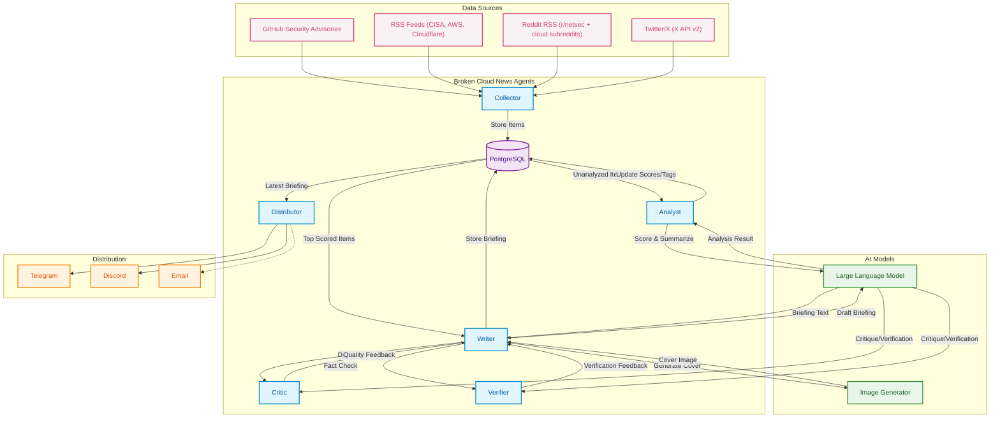

<p align="center">
  
</p>

---

## Architecture

Six A2A agents work together (four scheduled pipeline agents plus critic and verifier quality agents), coordinated by an internal scheduler. Each agent runs as an independent HTTP server using the Google Agent-to-Agent protocol.

<div align="center">



</div>

### Agent Details

| Agent | Port | Trigger | Role |
|-------|------|---------|------|
| **Collector** | 9001 | Every 2-6h | Fetches GHSA, RSS (CISA/AWS/Cloudflare), Reddit RSS, Twitter/X via API v2 |
| **Analyst** | 9002 | Every 15m | Scores relevance (1-10) and summarizes via configured LLM |
| **Writer** | 9003 | Daily + Monthly | Generates briefings/newsletters and cover images (Gemini image or Flux fallback) |
| **Critic** | 9005 | On-demand | Scores/criticizes briefing quality (LLM + deterministic gate) |
| **Verifier** | 9006 | On-demand | Verifies factual grounding, link hygiene, and hard issue checks |
| **Distributor** | 9004 | After Writer | Mode-aware distribution (daily/ad-hoc: Telegram+Discord, monthly: email) |

All agents communicate via the **A2A JSON-RPC protocol** and share state through PostgreSQL. The scheduler orchestrates the pipeline automatically in daemon mode.

---

## Quick Start

### Prerequisites
- Python 3.12+
- Docker & Docker Compose
- NVIDIA DGX / GPU server with Qwen + ComfyUI deployed (see [AI Infrastructure](#ai-infrastructure))

### Setup
```bash
git clone https://github.com/andreyka/broken-cloud-news.git
cd broken-cloud-news

# Interactive setup (handles docker vs managed DB, channel tokens, and startup checks)
./setup.sh
```

Manual setup is still supported if needed (`cp .env.example .env`, edit values, then `docker compose up -d`).

### Run

**CLI commands:**
```bash
bcn collect              # Collect from all sources
bcn collect -s ghsa      # Collect GHSA only
bcn collect -s reddit    # Collect Reddit RSS only
bcn analyze              # Analyze new items with LLM
bcn write --mode regular_daily_briefing
bcn write --mode regular_monthly_newsletter
bcn critique --latest    # Critique latest briefing (quality report JSON)
bcn critique --file ./draft.md
bcn simulate --limit 30 --output simulation_report.json  # Backtest vs historical briefings (no publish)
bcn simulate --limit 0 --with-critic-rewrites            # Full heavy replay with writer->critic rewrites
bcn simulate --store-db                                   # Persist run/results in DB and compare with previous run
bcn review --decision accept --issue-tag style            # Store human review labels for latest briefing
bcn review-queue --only-unreviewed                        # List briefings needing manual review
bcn finalize-pending-runs --max-age-minutes 180           # Finalize stale trace runs stuck in PENDING
bcn record-outcome --briefing-id <uuid> --channel telegram --views 1200 --clicks 74
bcn import-history --file ./channel_history.txt --dry-run # Parse historical channel posts
bcn export-training --output-dir training_export          # Export SFT + preference JSONL datasets
bcn distribute --mode regular_daily_briefing
bcn distribute --mode regular_monthly_newsletter --briefing-id <uuid>
bcn newsletter-subscribers add you@example.com
bcn newsletter-subscribers list
bcn workflow-run --mode ad_hoc
bcn pipeline --mode regular_daily_briefing
```

**Daemon mode** (all agents + scheduler):
```bash
bcn run
```

**Docker (full stack):**
```bash
docker compose up -d
```

The Compose stack now routes outbound HTTP(S) through an internal Squid proxy
that blocks private/metadata destinations by default. Keep internal services
such as Postgres/ComfyUI reachable via `NO_PROXY` hostnames (set `NO_PROXY`
in `.env` to include your internal ComfyUI host/IP).

---

## Configuration

All settings via environment variables with `BCN_` prefix. See `.env.example` for the full list.

| Variable | Default | Description |
|----------|---------|-------------|
| `BCN_SETUP_DATABASE_MODE` | `docker` | Setup hint for `setup.sh` (`docker` or `managed`) |
| `BCN_DATABASE_URL` | `postgresql://...` | PostgreSQL connection string |
| `BCN_LLM_PROVIDER` | `openai_compat` | LLM provider (`openai_compat`, `gemini`, `vertexai`, or `anthropic`) |
| `BCN_LLM_BASE_URL` | `http://192.168.0.9:8000/v1` | Qwen API endpoint |
| `BCN_LLM_MODEL` | `Qwen/Qwen3-VL-30B-A3B-Instruct-FP8` | Default model used by all LLM roles |
| `BCN_LLM_API_KEY` | - | Optional API key (used for hosted providers) |
| `BCN_LLM_MODEL_ANALYST` ... `BCN_LLM_MODEL_COVER` | empty | Optional per-role model override (analyst/writer/critic/verifier/cover) |
| `BCN_LLM_PROVIDER_ANALYST` ... `BCN_LLM_PROVIDER_COVER` | empty | Optional per-role provider override |
| `BCN_LLM_BASE_URL_ANALYST` ... `BCN_LLM_BASE_URL_COVER` | empty | Optional per-role endpoint override |
| `BCN_COMFYUI_URL` | `http://192.168.0.9:8188` | ComfyUI Flux endpoint |
| `BCN_GITHUB_TOKEN` | - | GitHub API token for GHSA |
| `BCN_TWITTER_BEARER_TOKEN` | - | X API v2 bearer token |
| `BCN_TELEGRAM_BOT_TOKEN` | - | Telegram bot token |
| `BCN_TELEGRAM_CHAT_ID` | - | Telegram channel chat ID |
| `BCN_DISCORD_BOT_TOKEN` | - | Discord bot token |
| `BCN_DISCORD_CHANNEL_ID` | - | Discord target channel ID |
| `BCN_RELEVANCE_THRESHOLD` | `7` | Min score (1-10) to include in briefing |
| `BCN_DISTRIBUTE_HOURS` | empty | Optional comma/JSON list of digest hours (e.g. `9,13,19`) |
| `BCN_DISTRIBUTE_HOUR` | `9` | Legacy single digest hour fallback when `BCN_DISTRIBUTE_HOURS` is empty |
| `BCN_DISTRIBUTE_MINUTE` | `0` | Minute used for digest cron scheduling |
| `BCN_DISTRIBUTE_TIMEZONE` | `UTC` | IANA timezone for digest cron (e.g. `America/Los_Angeles`) |
| `BCN_MONTHLY_NEWSLETTER_ENABLED` | `true` | Enable monthly newsletter scheduler job |
| `BCN_MONTHLY_NEWSLETTER_DAY` | `1` | Day-of-month for monthly newsletter publish |
| `BCN_MONTHLY_NEWSLETTER_HOUR` | `9` | Hour for monthly newsletter publish |
| `BCN_MONTHLY_NEWSLETTER_MINUTE` | `0` | Minute for monthly newsletter publish |
| `BCN_MONTHLY_NEWSLETTER_TIMEZONE` | `UTC` | IANA timezone for monthly newsletter cron |
| `BCN_GENERATION_RUN_STALE_PENDING_MINUTES` | `180` | Auto-finalize stale writer trace runs left in `PENDING` |

Gemini trial example (role-based):
```bash
BCN_LLM_PROVIDER=vertexai
BCN_LLM_BASE_URL=https://aiplatform.googleapis.com/v1
BCN_LLM_API_KEY=<your_vertex_key>
BCN_LLM_MODEL_ANALYST=gemini-3.1-pro-preview
BCN_LLM_MODEL_WRITER=gemini-3.1-pro-preview
BCN_LLM_MODEL_CRITIC=gemini-3.1-pro-preview
BCN_LLM_MODEL_VERIFIER=gemini-3.1-pro-preview
BCN_LLM_MODEL_COVER=nanobanana-pro2
```
Notes:
- `vertexai` routes text roles to Vertex `streamGenerateContent`.
- Cover role can return inline PNG image data when set to an image-capable Gemini/Vertex model such as `nanobanana-pro2`.
- If cover image generation fails, writer falls back to ComfyUI automatically.

Important briefing-quality knobs:
- `BCN_BRIEFING_MAX_RSS_ITEMS` (default `3`) limits RSS dominance.
- `BCN_BRIEFING_MAX_ITEMS_PER_DOMAIN` (default `2`) prevents single-domain monoculture.
- `BCN_BRIEFING_MIN_SELECTED_ITEMS` (default `1`) allows one-item briefings on low-volume days.
- `BCN_BRIEFING_MIN_CHARS`/`BCN_BRIEFING_TARGET_CHARS`/`BCN_BRIEFING_HARD_MAX_CHARS`
  (defaults `1200`/`1700`/`2300`) increase depth while keeping Telegram-safe output.
- `BCN_BRIEFING_SINGLE_ITEM_MIN_CHARS`/`BCN_BRIEFING_SINGLE_ITEM_TARGET_CHARS`/
  `BCN_BRIEFING_SINGLE_ITEM_HARD_MAX_CHARS` relax depth limits for single-item days.
- `BCN_BRIEFING_SKIP_IF_NO_HIGH_SIGNAL` + `BCN_BRIEFING_MIN_HIGH_SIGNAL_TO_PUBLISH`
  can skip a day entirely when there is no truly actionable signal.
- `BCN_BRIEFING_SOCIAL_PROOF_WEIGHT` + `BCN_BRIEFING_SOCIAL_PROOF_MAX_BONUS`
  add bounded engagement influence (likes/retweets/upvotes/comments) to ranking.
- `BCN_BRIEFING_CRITIQUE_MAX_ROUNDS` (default `5`) sets max writer rewrites in the
  writer->critic loop before publishing the best available draft.
- `BCN_BRIEFING_GATE_MODE` (default `balanced`) controls deterministic strictness:
  `strict` (structure rules are blocking), `balanced` (structure/style are advisory),
  `minimal` (only hard correctness checks block).
- `BCN_BRIEFING_MONTHLY_MIN_CHARS` / `BCN_BRIEFING_MONTHLY_TARGET_CHARS` /
  `BCN_BRIEFING_MONTHLY_HARD_MAX_CHARS` set newsletter depth envelope.
- `BCN_MONTHLY_NEWSLETTER_LOOKBACK_DAYS` + `BCN_MONTHLY_NEWSLETTER_MAX_ITEMS`
  control monthly item window breadth and total section count.
- `BCN_SCRAPE_PLAYWRIGHT_FETCH_FALLBACK` (default `true`) uses Playwright request
  fallback when direct HTTP fetches of feeds/Reddit endpoints fail.
- `BCN_DISTRIBUTE_HOURS` + `BCN_DISTRIBUTE_TIMEZONE` support multiple daily publish
  slots without external cron (example: `BCN_DISTRIBUTE_HOURS=9,13,19`).

Workflow channel policy:
- `regular_daily_briefing`: Telegram + Discord
- `ad_hoc`: Telegram + Discord
- `regular_monthly_newsletter`: Email only (DB-backed subscriber list)

Monthly newsletter subscribers are managed via CLI:
- `bcn newsletter-subscribers add you@example.com`
- `bcn newsletter-subscribers remove you@example.com`
- `bcn newsletter-subscribers list`

---

## AI Infrastructure & Serving API

You can deploy the AI backend entirely in the cloud using Google's Gemini API, Anthropic's Claude API, or run the models on-premise (e.g., NVIDIA DGX Spark).

### Option 1: Gemini API (Cloud)

The simplest deployment uses Google's Vertex AI / Gemini API for both text and image generation.

1. Get a Vertex AI or Gemini API key.
2. Update your `.env` file to use the Gemini provider and models:
   ```bash
   BCN_LLM_PROVIDER=vertexai
   BCN_LLM_BASE_URL=https://aiplatform.googleapis.com/v1
   BCN_LLM_API_KEY=<your_vertex_key>
   BCN_LLM_MODEL_ANALYST=gemini-3.1-pro-preview
   BCN_LLM_MODEL_WRITER=gemini-3.1-pro-preview
   BCN_LLM_MODEL_CRITIC=gemini-3.1-pro-preview
   BCN_LLM_MODEL_VERIFIER=gemini-3.1-pro-preview
   BCN_LLM_MODEL_COVER=nanobanana-pro2
   ```
*(Note: Using an image-capable cover model such as `nanobanana-pro2` enables native image generation without needing ComfyUI in the success path).*

### Option 2: Anthropic Claude API (Cloud)

Use Claude models for text analysis and generation roles.

1. Get an Anthropic API key from [console.anthropic.com](https://console.anthropic.com).
2. Update your `.env` file:
   ```bash
   BCN_LLM_PROVIDER=anthropic
   BCN_LLM_BASE_URL=https://api.anthropic.com
   BCN_LLM_API_KEY=sk-ant-...
   BCN_LLM_MODEL=claude-sonnet-4-20250514
   ```
   Or use per-role overrides to mix providers (e.g., Claude for writer/critic, Gemini for cover):
   ```bash
   BCN_LLM_PROVIDER_WRITER=anthropic
   BCN_LLM_MODEL_WRITER=claude-sonnet-4-20250514
   BCN_LLM_API_KEY_WRITER=sk-ant-...
   BCN_LLM_PROVIDER_CRITIC=anthropic
   BCN_LLM_MODEL_CRITIC=claude-sonnet-4-20250514
   BCN_LLM_API_KEY_CRITIC=sk-ant-...
   BCN_LLM_PROVIDER_COVER=vertexai
   BCN_LLM_MODEL_COVER=nanobanana-pro2
   ```
*(Note: Claude does not support image generation, so cover image roles should use Gemini/Vertex or ComfyUI.)*

### Option 3: DGX Spark (On-Premise)

For fully local, high-performance execution, deploy Qwen3-VL and Flux.1-schnell.

#### 1. Qwen3-VL (LLM Inference)

Runs as an OpenAI-compatible API via **vLLM**:

```bash
docker run --rm -it \
    --gpus all \
    --ipc=host \
    --shm-size=32g \
    -p 8000:8000 \
    -v ~/.cache/huggingface:/root/.cache/huggingface \
    nvcr.io/nvidia/vllm:25.12.post1-py3 \
    vllm serve Qwen/Qwen3-VL-30B-A3B-Instruct-FP8 \
    --host 0.0.0.0 --port 8000 \
    --trust-remote-code \
    --dtype auto \
    --gpu-memory-utilization 0.55 \
    --max-model-len 16384
```

#### 2. Flux.1-schnell (Cover Image Generation)

Runs **ComfyUI** with a Flux-compatible checkpoint. This repo does not ship a
ComfyUI Dockerfile; deploy ComfyUI separately and point BCN at it:

```bash
# Example endpoint configuration after ComfyUI is running:
BCN_COMFYUI_URL=http://<comfyui-host>:8188
```

---

## A2A Protocol

Each agent exposes a standard Google A2A interface:
- Agent Card at `GET /.well-known/agent.json`
- Message handling via JSON-RPC

```python
from a2a.client import A2AClient
from a2a.types import Message
from a2a.types import MessageSendParams
from a2a.types import SendMessageRequest
from a2a.types import TextPart
import httpx
from uuid import uuid4

async with httpx.AsyncClient(timeout=180) as http:
    client = A2AClient(http, url="http://localhost:9001")
    message = Message(
        role="user",
        parts=[TextPart(text="collect_rss")],
        message_id=uuid4().hex,
    )
    request = SendMessageRequest(
        id=uuid4().hex,
        params=MessageSendParams(message=message),
    )
    response = await client.send_message(request)
```

---

## Project Structure
```
bcn/
  cli.py              CLI command wiring (thin entrypoint)
  simulation.py       Historical briefing replay + comparison scoring
  common/
    config.py         Pydantic Settings (env vars)
    db.py             asyncpg database layer
    models.py         Pydantic data models
    llm.py            Role-aware LLM router/client (analysis + briefing)
    comfyui.py        ComfyUI Flux client (cover images)
    scraper.py        Playwright headless Chromium scraper
    url_policy.py     SSRF policy + URL normalization helpers
  workflows/
    runtime.py        Shared runtime wiring (settings + sender)
    automation.py     Scheduler jobs + mode facade
    modes/
      common.py
      regular_daily_briefing.py
      ad_hoc.py
      regular_monthly_newsletter.py
  agents/
    base.py           A2A agent boilerplate
    collector/
      agent.py        Data collection (GHSA, RSS, Reddit, Twitter/X)
    analyst/
      agent.py        LLM relevance scoring + summarization
    writer/
      agent.py        Briefing + cover image generation
    critic/
      agent.py        Briefing critique and quality assessment
    verifier/
      agent.py        Briefing factual verification
    distributor/
      agent.py        Mode-aware multi-channel distribution
  briefing/
    selection.py      Ranking + diversity-aware item selection
    quality.py        Deterministic quality gate checks
    verifier.py       Fact-check orchestration for writer loop
    text.py           Markdown normalization and fallback formatting
  distributors/
    telegram.py       Telegram Bot API (photo + caption)
    discord.py        Discord Bot API
    email.py          SMTP email
    slack.py          Slack webhook client (available, not in default mode policy)
assets/
  logo.png            Project logo
```
