<p align="center">
  
</p>

---

## Architecture

Broken Cloud News is now organized around a control plane plus domain services.
The workflow and evaluation layers own scheduling, retries, persistence, and DB
state transitions. Collection, analysis, generation, review, and distribution
logic live behind simple service boundaries and typed contracts. Local
deployments call those services in-process; remote deployments can hang HTTP
adapters off the same contracts behind a load balancer.

```mermaid
flowchart TB
    classDef source fill:#f9f2f4,stroke:#d04376,stroke-width:2px,color:#d04376
    classDef control fill:#e3f2fd,stroke:#1565c0,stroke-width:2px,color:#0d47a1
    classDef service fill:#e8f5e9,stroke:#2e7d32,stroke-width:2px,color:#1b5e20
    classDef adapter fill:#fff8e1,stroke:#ef6c00,stroke-width:2px,color:#e65100
    classDef db fill:#f3e5f5,stroke:#7b1fa2,stroke-width:2px,color:#4a148c
    classDef ai fill:#ede7f6,stroke:#5e35b1,stroke-width:2px,color:#311b92
    classDef channel fill:#fff3e0,stroke:#f57c00,stroke-width:2px,color:#e65100

    subgraph Sources["Data Sources"]
        GHSA["GitHub Security Advisories"]:::source
        RSS["RSS Feeds (CISA, AWS, Cloudflare)"]:::source
        Reddit["Reddit RSS (r/netsec + cloud subreddits)"]:::source
        Twitter["Twitter/X (X API v2)"]:::source
    end

    subgraph Control["Control Plane"]
        Workflow["Workflow Service"]:::control
        Evaluation["Evaluation Service"]:::control
    end

    subgraph Domain["Domain Services"]
        direction TB
        Collection["Collection"]:::service
        Analysis["Analysis"]:::service
        Generation["Generation"]:::service
        Review["Critique / Verification"]:::service
        Distribution["Distribution"]:::service
        DB[("PostgreSQL")]:::db
    end

    subgraph Adapters["Optional Transport Adapters"]
        CollectorAdapter["Collector HTTP Adapter"]:::adapter
        AnalystAdapter["Analyst HTTP Adapter"]:::adapter
        WriterAdapter["Writer HTTP Adapter"]:::adapter
        CriticAdapter["Critic HTTP Adapter"]:::adapter
        VerifierAdapter["Verifier HTTP Adapter"]:::adapter
    end

    subgraph AI["AI Models"]
        LLM["Large Language Model"]:::ai
        ImageGen["Image Generator"]:::ai
    end

    subgraph Channels["Distribution"]
        TG["Telegram"]:::channel
        Discord["Discord"]:::channel
        Email["Email"]:::channel
    end

    Workflow --> Collection
    Workflow --> Analysis
    Workflow --> Generation
    Workflow --> Review
    Workflow --> Distribution
    Evaluation --> Analysis
    Evaluation --> Generation
    Evaluation --> Review

    GHSA --> Collection
    RSS --> Collection
    Reddit --> Collection
    Twitter --> Collection
    Collection -->|Persist Items| DB
    DB -->|New Items| Analysis
    Analysis -->|Analyzed Updates| DB
    DB -->|Selected Items| Generation
    Generation -->|Draft| Review
    Review -->|Feedback| Generation
    Generation -->|Persist Briefing| DB
    DB -->|Briefing| Distribution
    Distribution --> TG
    Distribution --> Discord
    Distribution -.-> Email

    LLM --> Analysis
    LLM --> Generation
    LLM --> Review
    ImageGen --> Generation

    CollectorAdapter -.-> Collection
    AnalystAdapter -.-> Analysis
    WriterAdapter -.-> Generation
    CriticAdapter -.-> Review
    VerifierAdapter -.-> Review
```

<div align="center">



</div>

### Service Boundaries

| Boundary | Current owner | Remote-ready contract | Role |
|----------|---------------|-----------------------|------|
| **Collection** | `bcn/workflows/collection.py` + `bcn/agents/collector/service.py` | Planned HTTP adapter | Fetch GHSA, RSS, Reddit, Twitter/X and persist items |
| **Analysis** | `bcn/workflows/analysis.py` + `bcn/agents/analyst/service.py` | Planned HTTP adapter | Score relevance, summarize, and persist analyzed updates |
| **Generation** | `bcn/workflows/generation.py` + `bcn/agents/writer/service.py` | `bcn/contracts/workflow.py` | Build briefings/newsletters, run rewrite loop, persist outcome |
| **Review** | `bcn/workflows/review.py` + critic/verifier services | `bcn/contracts/review.py` | Evaluate explicit draft payloads for quality and verification |
| **Distribution** | `bcn/workflows/distribution.py` + `bcn/agents/distributor/service.py` | Planned HTTP adapter | Deliver briefing to Telegram, Discord, and email |

State ownership is now explicit:
- the control plane owns DB transitions, retries, and orchestration
- domain services do the work and return structured results
- cross-service payloads live in `bcn/contracts`
- distribution is a plain service, not an agent

### Orchestration Layer

The CLI is thin now. Main orchestration is not embedded in `cli.py`.

- [`bcn/cli.py`](bcn/cli.py) parses flags, calls services, and prints results.
- [`bcn/workflows/service.py`](bcn/workflows/service.py) owns daemon startup,
  scheduler registration, and workflow-mode execution.
- [`bcn/workflows/automation.py`](bcn/workflows/automation.py) exposes
  scheduled jobs and mode-aware automation entry points.
- [`bcn/workflows/collection.py`](bcn/workflows/collection.py),
  [`bcn/workflows/analysis.py`](bcn/workflows/analysis.py),
  [`bcn/workflows/generation.py`](bcn/workflows/generation.py),
  [`bcn/workflows/distribution.py`](bcn/workflows/distribution.py), and
  [`bcn/workflows/review.py`](bcn/workflows/review.py) own control-plane state
  transitions.
- [`bcn/contracts/`](bcn/contracts/) defines the typed request/result payloads
  shared across workflow and review boundaries.

Important distinction:
- This orchestration layer is a `service layer in code`, not a separately
  deployed network service by itself.
- `bcn run` starts the scheduler/control plane only.
- Remote deployment is expected to happen through explicit service adapters,
  not hidden in-process agent servers.

So the current architecture is best described as a `control-plane modular
system with microservice-ready service contracts`. Workflow state is still
centralized, but the service seams are now straightforward to expose remotely.

### Deployment Model

Today there are two different layers to keep in mind:

- `Code architecture`: control-plane services, domain services, typed
  contracts, DB layer, and channel distributors.
- `Deployment architecture`: one main BCN daemon/container, one Postgres
  container, one dashboard container, and supporting proxy/bridge containers.

That means:
- in `daemon mode`, the workflow service owns the pipeline and calls local
  services by default
- CLI commands run through service boundaries, not directly through stateful
  wrappers
- all business state still lives in one Postgres database
- benchmark, shadow, and replay lanes are internal evaluation services, not
  separate deployed apps
- the Next.js dashboard is separate and read-only against persisted evaluation
  data

### Next Steps

The remaining work is about adding explicit transport adapters where remote
deployment is worth the complexity:

1. Add HTTP adapters for `writer`, `critic`, and `verifier` first, because they
   are the most natural candidates for separate scaling and GPU placement.
2. Keep scheduler and DB-state transitions in the control plane unless there is
   a strong reason to decentralize them.
3. Add service discovery / load-balancer URLs only when a remote adapter exists,
   instead of keeping dead config around speculatively.

---

## Quick Start

### Prerequisites
- Python 3.12+
- Docker & Docker Compose
- NVIDIA DGX / GPU server with Qwen + ComfyUI deployed (see [AI Infrastructure](#ai-infrastructure))

### Setup
```bash
git clone https://github.com/andreyka/broken-cloud-news.git
cd broken-cloud-news

# Interactive setup (handles docker vs managed DB, channel tokens, and startup checks)
./setup.sh
```

Manual setup is still supported if needed (`cp .env.example .env`, edit values, then `docker compose up -d`).

### Run

**CLI commands:**
```bash
bcn collect              # Collect from all sources
bcn collect -s ghsa      # Collect GHSA only
bcn collect -s reddit    # Collect Reddit RSS only
bcn analyze              # Analyze new items with LLM
bcn write --mode regular_daily_briefing
bcn write --mode regular_monthly_newsletter
bcn critique --latest    # Critique latest briefing (quality report JSON)
bcn critique --file ./draft.md
bcn simulate --limit 30 --output simulation_report.json  # Backtest vs historical briefings (no publish)
bcn simulate --limit 0 --with-critic-rewrites            # Full heavy replay with writer->critic rewrites
bcn simulate --store-db                                   # Persist run/results in DB and compare with previous run
bcn benchmark-pack --output benchmark_pack.json
bcn benchmark --cases benchmark_pack.json --candidate-overrides candidate.json
bcn shadow --candidate-overrides candidate.json --store-db
bcn evaluation-runs --limit 10
bcn review --decision accept --issue-tag style            # Store human review labels for latest briefing
bcn review-queue --only-unreviewed                        # List briefings needing manual review
bcn finalize-pending-runs --max-age-minutes 180           # Finalize stale trace runs stuck in PENDING
bcn record-outcome --briefing-id <uuid> --channel telegram --views 1200 --clicks 74
bcn import-history --file ./channel_history.txt --dry-run # Parse historical channel posts
bcn export-training --output-dir training_export          # Export SFT + preference JSONL datasets, including shadow preferences
bcn distribute --mode regular_daily_briefing
bcn distribute --mode regular_monthly_newsletter --briefing-id <uuid>
bcn newsletter-subscribers add you@example.com
bcn newsletter-subscribers list
bcn workflow-run --mode ad_hoc
bcn pipeline --mode regular_daily_briefing
```

**Daemon mode** (scheduler + recurring jobs):
```bash
bcn run
```

`bcn run` now delegates to the workflow orchestration service in
[`bcn/workflows/service.py`](bcn/workflows/service.py), which boots the
scheduler and recurring jobs.

**Docker (full stack):**
```bash
docker compose up -d
```

The evaluation dashboard runs as a separate Next.js container on port `3007`
and reads persisted benchmark and shadow runs directly from Postgres.

The bundled challenger file [`bcn/config/shadow_qwen_spark.json`](bcn/config/shadow_qwen_spark.json)
targets the internal `spark_bridge` service, which forwards to the SBC-visible
Spark/Qwen endpoint without giving the main `bcn` container direct LAN access.

The Compose stack now routes outbound HTTP(S) through an internal Squid proxy
that blocks private/metadata destinations by default. Keep internal services
such as Postgres/ComfyUI reachable via `NO_PROXY` hostnames (set `NO_PROXY`
in `.env` to include your internal ComfyUI host/IP).

---

## Configuration

All settings via environment variables with `BCN_` prefix. See `.env.example` for the full list.

| Variable | Default | Description |
|----------|---------|-------------|
| `BCN_SETUP_DATABASE_MODE` | `docker` | Setup hint for `setup.sh` (`docker` or `managed`) |
| `BCN_DATABASE_URL` | `postgresql://...` | PostgreSQL connection string |
| `BCN_LLM_PROVIDER` | `openai_compat` | LLM provider (`openai_compat`, `gemini`, or `vertexai`) |
| `BCN_LLM_BASE_URL` | `http://192.168.0.9:8000/v1` | Qwen API endpoint |
| `BCN_LLM_MODEL` | `Qwen/Qwen3-VL-30B-A3B-Instruct-FP8` | Default model used by all LLM roles |
| `BCN_LLM_API_KEY` | - | Optional API key (used for hosted providers) |
| `BCN_LLM_MODEL_ANALYST` ... `BCN_LLM_MODEL_COVER` | empty | Optional per-role model override (analyst/writer/critic/verifier/cover) |
| `BCN_LLM_PROVIDER_ANALYST` ... `BCN_LLM_PROVIDER_COVER` | empty | Optional per-role provider override |
| `BCN_LLM_BASE_URL_ANALYST` ... `BCN_LLM_BASE_URL_COVER` | empty | Optional per-role endpoint override |
| `BCN_COMFYUI_URL` | `http://192.168.0.9:8188` | ComfyUI Flux endpoint |
| `BCN_GITHUB_TOKEN` | - | GitHub API token for GHSA |
| `BCN_TWITTER_BEARER_TOKEN` | - | X API v2 bearer token |
| `BCN_TELEGRAM_BOT_TOKEN` | - | Telegram bot token |
| `BCN_TELEGRAM_CHAT_ID` | - | Telegram channel chat ID |
| `BCN_DISCORD_BOT_TOKEN` | - | Discord bot token |
| `BCN_DISCORD_CHANNEL_ID` | - | Discord target channel ID |
| `BCN_RELEVANCE_THRESHOLD` | `7` | Min score (1-10) to include in briefing |
| `BCN_DISTRIBUTE_HOURS` | empty | Optional comma/JSON list of digest hours (e.g. `9,13,19`) |
| `BCN_DISTRIBUTE_HOUR` | `9` | Legacy single digest hour fallback when `BCN_DISTRIBUTE_HOURS` is empty |
| `BCN_DISTRIBUTE_MINUTE` | `0` | Minute used for digest cron scheduling |
| `BCN_DISTRIBUTE_TIMEZONE` | `UTC` | IANA timezone for digest cron (e.g. `America/Los_Angeles`) |
| `BCN_SHADOW_ENABLED` | `false` | Enable scheduled pre-publish shadow runs in daemon mode |
| `BCN_SHADOW_MINUTES_BEFORE_PUBLISH` | `45` | Minutes before each daily publish slot to execute the shadow lane |
| `BCN_SHADOW_CANDIDATE_OVERRIDES_PATH` | empty | JSON overrides file for the challenger used by scheduled shadow |
| `BCN_SHADOW_INCLUDE_TEXT` | `false` | Persist generated text in scheduled shadow reports (recommended `true` if you want future Qwen preference/export data) |
| `BCN_MONTHLY_NEWSLETTER_ENABLED` | `true` | Enable monthly newsletter scheduler job |
| `BCN_MONTHLY_NEWSLETTER_DAY` | `1` | Day-of-month for monthly newsletter publish |
| `BCN_MONTHLY_NEWSLETTER_HOUR` | `9` | Hour for monthly newsletter publish |
| `BCN_MONTHLY_NEWSLETTER_MINUTE` | `0` | Minute for monthly newsletter publish |
| `BCN_MONTHLY_NEWSLETTER_TIMEZONE` | `UTC` | IANA timezone for monthly newsletter cron |
| `BCN_GENERATION_RUN_STALE_PENDING_MINUTES` | `180` | Auto-finalize stale writer trace runs left in `PENDING` |

Gemini trial example (role-based):
```bash
BCN_LLM_PROVIDER=vertexai
BCN_LLM_BASE_URL=https://aiplatform.googleapis.com/v1
BCN_LLM_API_KEY=<your_vertex_key>
BCN_LLM_MODEL_ANALYST=gemini-3.1-pro-preview
BCN_LLM_MODEL_WRITER=gemini-3.1-pro-preview
BCN_LLM_MODEL_CRITIC=gemini-3.1-pro-preview
BCN_LLM_MODEL_VERIFIER=gemini-3.1-pro-preview
BCN_LLM_MODEL_COVER=nanobanana-pro2
```
Notes:
- `vertexai` routes text roles to Vertex `streamGenerateContent`.
- Cover role can return inline PNG image data when set to an image-capable Gemini/Vertex model such as `nanobanana-pro2`.
- If cover image generation fails, writer falls back to ComfyUI automatically.

Important briefing-quality knobs:
- `BCN_BRIEFING_MAX_RSS_ITEMS` (default `3`) limits RSS dominance.
- `BCN_BRIEFING_MAX_ITEMS_PER_DOMAIN` (default `2`) prevents single-domain monoculture.
- `BCN_BRIEFING_MIN_SELECTED_ITEMS` (default `1`) allows one-item briefings on low-volume days.
- `BCN_BRIEFING_MIN_CHARS`/`BCN_BRIEFING_TARGET_CHARS`/`BCN_BRIEFING_HARD_MAX_CHARS`
  (defaults `1200`/`1700`/`2300`) increase depth while keeping Telegram-safe output.
- `BCN_BRIEFING_SINGLE_ITEM_MIN_CHARS`/`BCN_BRIEFING_SINGLE_ITEM_TARGET_CHARS`/
  `BCN_BRIEFING_SINGLE_ITEM_HARD_MAX_CHARS` relax depth limits for single-item days.
- `BCN_BRIEFING_SKIP_IF_NO_HIGH_SIGNAL` + `BCN_BRIEFING_MIN_HIGH_SIGNAL_TO_PUBLISH`
  can skip a day entirely when there is no truly actionable signal.
- `BCN_BRIEFING_SOCIAL_PROOF_WEIGHT` + `BCN_BRIEFING_SOCIAL_PROOF_MAX_BONUS`
  add bounded engagement influence (likes/retweets/upvotes/comments) to ranking.
- `BCN_BRIEFING_CRITIQUE_MAX_ROUNDS` (default `5`) sets max writer rewrites in the
  writer->critic loop before publishing the best available draft.
- `BCN_BRIEFING_GATE_MODE` (default `balanced`) controls deterministic strictness:
  `strict` (structure rules are blocking), `balanced` (structure/style are advisory),
  `minimal` (only hard correctness checks block).
- `BCN_BRIEFING_MONTHLY_MIN_CHARS` / `BCN_BRIEFING_MONTHLY_TARGET_CHARS` /
  `BCN_BRIEFING_MONTHLY_HARD_MAX_CHARS` set newsletter depth envelope.
- `BCN_MONTHLY_NEWSLETTER_LOOKBACK_DAYS` + `BCN_MONTHLY_NEWSLETTER_MAX_ITEMS`
  control monthly item window breadth and total section count.
- `BCN_SCRAPE_PLAYWRIGHT_FETCH_FALLBACK` (default `true`) uses Playwright request
  fallback when direct HTTP fetches of feeds/Reddit endpoints fail.
- `BCN_DISTRIBUTE_HOURS` + `BCN_DISTRIBUTE_TIMEZONE` support multiple daily publish
  slots without external cron (example: `BCN_DISTRIBUTE_HOURS=9,13,19`).

Workflow channel policy:
- `regular_daily_briefing`: Telegram + Discord
- `ad_hoc`: Telegram + Discord
- `regular_monthly_newsletter`: Email only (DB-backed subscriber list)

Monthly newsletter subscribers are managed via CLI:
- `bcn newsletter-subscribers add you@example.com`
- `bcn newsletter-subscribers remove you@example.com`
- `bcn newsletter-subscribers list`

---

## AI Infrastructure & Serving API

You can deploy the AI backend entirely in the cloud using Google's Gemini API, or run the models on-premise (e.g., NVIDIA DGX Spark).

### Option 1: Gemini API (Cloud)

The simplest deployment uses Google's Vertex AI / Gemini API for both text and image generation.

1. Get a Vertex AI or Gemini API key.
2. Update your `.env` file to use the Gemini provider and models:
   ```bash
   BCN_LLM_PROVIDER=vertexai
   BCN_LLM_BASE_URL=https://aiplatform.googleapis.com/v1
   BCN_LLM_API_KEY=<your_vertex_key>
   BCN_LLM_MODEL_ANALYST=gemini-3.1-pro-preview
   BCN_LLM_MODEL_WRITER=gemini-3.1-pro-preview
   BCN_LLM_MODEL_CRITIC=gemini-3.1-pro-preview
   BCN_LLM_MODEL_VERIFIER=gemini-3.1-pro-preview
   BCN_LLM_MODEL_COVER=nanobanana-pro2
   ```
*(Note: Using an image-capable cover model such as `nanobanana-pro2` enables native image generation without needing ComfyUI in the success path).*

### Option 2: DGX Spark (On-Premise)

For fully local, high-performance execution, deploy Qwen3-VL and Flux.1-schnell.

#### 1. Qwen3-VL (LLM Inference)

Runs as an OpenAI-compatible API via **vLLM**:

```bash
docker run --rm -it \
    --gpus all \
    --ipc=host \
    --shm-size=32g \
    -p 8000:8000 \
    -v ~/.cache/huggingface:/root/.cache/huggingface \
    nvcr.io/nvidia/vllm:25.12.post1-py3 \
    vllm serve Qwen/Qwen3-VL-30B-A3B-Instruct-FP8 \
    --host 0.0.0.0 --port 8000 \
    --trust-remote-code \
    --dtype auto \
    --gpu-memory-utilization 0.55 \
    --max-model-len 16384
```

#### 2. Flux.1-schnell (Cover Image Generation)

Runs **ComfyUI** with a Flux-compatible checkpoint. This repo does not ship a
ComfyUI Dockerfile; deploy ComfyUI separately and point BCN at it:

```bash
# Example endpoint configuration after ComfyUI is running:
BCN_COMFYUI_URL=http://<comfyui-host>:8188
```

---

## Typed Service Contracts

Inter-service boundaries are defined in `bcn/contracts/`:
- `workflow.py` for writer handoff results
- `review.py` for critic/verifier request payloads

Those contracts are deliberately transport-agnostic. A future HTTP or queue
adapter should serialize these types directly instead of introducing a second
competing payload format.

---

## Project Structure
```
bcn/
  cli.py              CLI command wiring (thin entrypoint)
  common/
    config.py         Pydantic Settings (env vars)
    db.py             asyncpg database layer
    models.py         Pydantic data models
    llm.py            Role-aware LLM router/client (analysis + briefing)
    comfyui.py        ComfyUI Flux client (cover images)
    scraper.py        Playwright headless Chromium scraper
    url_policy.py     SSRF policy + URL normalization helpers
  contracts/
    workflow.py       Writer handoff contracts
    review.py         Critic / verifier request contracts
  evaluation/
    README.md         Replay / benchmark / shadow lane documentation
    lanes.py          Benchmark + shadow lane logic
    service.py        Evaluation persistence + report orchestration
    simulation.py     Historical replay lane implementation
  workflows/
    collection.py     Collection control plane (fan-out + persistence)
    analysis.py       Analysis control plane (claim + persist)
    generation.py     Generation control plane (claim + finalize)
    distribution.py   Distribution control plane (claim + persist)
    review.py         Critique/verification control plane
    runtime.py        Shared runtime wiring (settings only)
    automation.py     Scheduler jobs + mode facade
    service.py        Daemon startup + workflow-mode orchestration
    modes/
      common.py
      regular_daily_briefing.py
      ad_hoc.py
      regular_monthly_newsletter.py
  agents/
    collector/
      service.py      Pure collection logic
    analyst/
      service.py      Pure analysis logic
    writer/
      service.py      Pure generation logic
    critic/
      service.py      Pure critique logic
    verifier/
      service.py      Pure verification logic
    distributor/
      service.py      Plain multi-channel delivery logic
  briefing/
    selection.py      Ranking + diversity-aware item selection
    quality.py        Deterministic quality gate checks
    verifier.py       Fact-check orchestration for writer loop
    text.py           Markdown normalization and fallback formatting
  distributors/
    telegram.py       Telegram Bot API (photo + caption)
    discord.py        Discord Bot API
    email.py          SMTP email
    slack.py          Slack webhook client (available, not in default mode policy)
assets/
  logo.png            Project logo
```
