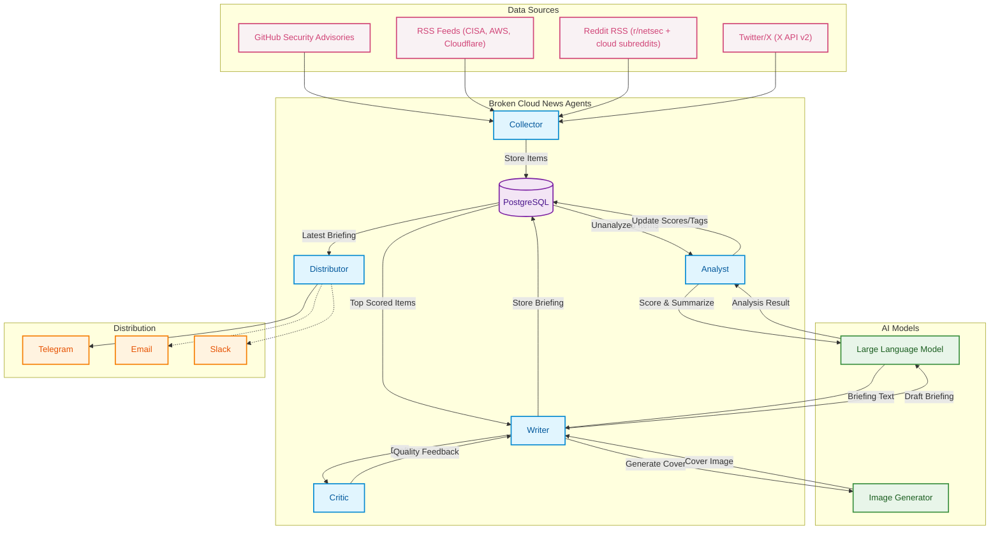

<p align="center">
  
</p>

---

## Architecture

Four A2A agents work together, coordinated by an internal scheduler. Each agent runs as an independent HTTP server using the Google Agent-to-Agent protocol.

<div align="center">



</div>

### Agent Details

| Agent | Port | Trigger | Role |
|-------|------|---------|------|
| **Collector** | 9001 | Every 2-6h | Fetches GHSA, RSS (CISA/AWS/Cloudflare), Reddit RSS, Twitter/X via API v2 |
| **Analyst** | 9002 | Every 15m | Scores relevance (1-10) and summarizes via Qwen LLM |
| **Writer** | 9003 | Daily 9:00 | Generates briefing and cover image (Gemini image or Flux fallback) |
| **Critic** | 9005 | On-demand | Scores/criticizes briefing quality (LLM + deterministic gate) |
| **Distributor** | 9004 | After Writer | Sends photo+caption to Telegram channel |

All agents communicate via the **A2A JSON-RPC protocol** and share state through PostgreSQL. The scheduler orchestrates the pipeline automatically in daemon mode.

---

## Quick Start

### Prerequisites
- Python 3.12+
- Docker & Docker Compose
- NVIDIA DGX / GPU server with Qwen + ComfyUI deployed (see [AI Infrastructure](#ai-infrastructure))

### Setup
```bash
git clone https://github.com/andreyka/broken-cloud-news.git
cd broken-cloud-news

# Start PostgreSQL
docker compose up -d postgres

# Install Python package
pip install -e .
playwright install chromium

# Configure
cp .env.example .env
# Edit .env with your tokens and endpoints
```

### Run

**CLI commands:**
```bash
bcn collect              # Collect from all sources
bcn collect -s ghsa      # Collect GHSA only
bcn collect -s reddit    # Collect Reddit RSS only
bcn analyze              # Analyze new items with LLM
bcn write                # Generate briefing + cover image
bcn critique --latest    # Critique latest briefing (quality report JSON)
bcn critique --file ./draft.md
bcn simulate --limit 30 --output simulation_report.json  # Backtest vs historical briefings (no publish)
bcn simulate --limit 0 --with-critic-rewrites            # Full heavy replay with writer->critic rewrites
bcn simulate --store-db                                   # Persist run/results in DB and compare with previous run
bcn review --decision accept --issue-tag style            # Store human review labels for latest briefing
bcn review-queue --only-unreviewed                        # List briefings needing manual review
bcn record-outcome --briefing-id <uuid> --channel telegram --views 1200 --clicks 74
bcn export-training --output-dir training_export          # Export SFT + preference JSONL datasets
bcn distribute           # Send to configured channels
bcn pipeline             # Full pipeline: collect -> analyze -> write -> distribute
```

**Daemon mode** (all agents + scheduler):
```bash
bcn run
```

**Docker (full stack):**
```bash
docker compose up -d
```

The Compose stack now routes outbound HTTP(S) through an internal Squid proxy
that blocks private/metadata destinations by default. Keep internal services
such as Postgres/ComfyUI reachable via `NO_PROXY` hostnames (set `NO_PROXY`
in `.env` to include your internal ComfyUI host/IP).

---

## Configuration

All settings via environment variables with `BCN_` prefix. See `.env.example` for the full list.

| Variable | Default | Description |
|----------|---------|-------------|
| `BCN_DATABASE_URL` | `postgresql://...` | PostgreSQL connection string |
| `BCN_LLM_PROVIDER` | `openai_compat` | LLM provider (`openai_compat`, `gemini`, or `vertexai`) |
| `BCN_LLM_BASE_URL` | `http://host.docker.internal:8000/v1` | Qwen API endpoint |
| `BCN_LLM_MODEL` | `Qwen/Qwen3-VL-30B-A3B-Instruct-FP8` | Default model used by all LLM roles |
| `BCN_LLM_API_KEY` | - | Optional API key (used for hosted providers) |
| `BCN_LLM_MODEL_ANALYST` ... `BCN_LLM_MODEL_COVER` | empty | Optional per-role model override (analyst/writer/critic/verifier/cover) |
| `BCN_LLM_PROVIDER_ANALYST` ... `BCN_LLM_PROVIDER_COVER` | empty | Optional per-role provider override |
| `BCN_LLM_BASE_URL_ANALYST` ... `BCN_LLM_BASE_URL_COVER` | empty | Optional per-role endpoint override |
| `BCN_COMFYUI_URL` | `http://host.docker.internal:8188` | ComfyUI Flux endpoint |
| `BCN_GITHUB_TOKEN` | - | GitHub API token for GHSA |
| `BCN_TWITTER_BEARER_TOKEN` | - | X API v2 bearer token |
| `BCN_TELEGRAM_BOT_TOKEN` | - | Telegram bot token |
| `BCN_TELEGRAM_CHAT_ID` | - | Telegram channel chat ID |
| `BCN_RELEVANCE_THRESHOLD` | `7` | Min score (1-10) to include in briefing |

Gemini trial example (role-based):
```bash
BCN_LLM_PROVIDER=vertexai
BCN_LLM_BASE_URL=https://aiplatform.googleapis.com/v1
BCN_LLM_API_KEY=<your_vertex_key>
BCN_LLM_MODEL_ANALYST=gemini-3.1-pro-preview
BCN_LLM_MODEL_WRITER=gemini-3.1-pro-preview
BCN_LLM_MODEL_CRITIC=gemini-3.1-pro-preview
BCN_LLM_MODEL_VERIFIER=gemini-3.1-pro-preview
BCN_LLM_MODEL_COVER=nanobanana-pro2
```
Notes:
- `vertexai` routes text roles to Vertex `streamGenerateContent`.
- Cover role can return inline PNG image data when set to an image-capable Gemini/Vertex model such as `nanobanana-pro2`.
- If cover image generation fails, writer falls back to ComfyUI automatically.

Important briefing-quality knobs:
- `BCN_BRIEFING_MAX_RSS_ITEMS` (default `3`) limits RSS dominance.
- `BCN_BRIEFING_MAX_ITEMS_PER_DOMAIN` (default `2`) prevents single-domain monoculture.
- `BCN_BRIEFING_MIN_SELECTED_ITEMS` (default `1`) allows one-item briefings on low-volume days.
- `BCN_BRIEFING_MIN_CHARS`/`BCN_BRIEFING_TARGET_CHARS`/`BCN_BRIEFING_HARD_MAX_CHARS`
  (defaults `1200`/`1700`/`2300`) increase depth while keeping Telegram-safe output.
- `BCN_BRIEFING_SINGLE_ITEM_MIN_CHARS`/`BCN_BRIEFING_SINGLE_ITEM_TARGET_CHARS`/
  `BCN_BRIEFING_SINGLE_ITEM_HARD_MAX_CHARS` relax depth limits for single-item days.
- `BCN_BRIEFING_SKIP_IF_NO_HIGH_SIGNAL` + `BCN_BRIEFING_MIN_HIGH_SIGNAL_TO_PUBLISH`
  can skip a day entirely when there is no truly actionable signal.
- `BCN_BRIEFING_SOCIAL_PROOF_WEIGHT` + `BCN_BRIEFING_SOCIAL_PROOF_MAX_BONUS`
  add bounded engagement influence (likes/retweets/upvotes/comments) to ranking.
- `BCN_BRIEFING_CRITIQUE_MAX_ROUNDS` (default `5`) sets max writer rewrites in the
  writer->critic loop before publishing the best available draft.
- `BCN_BRIEFING_GATE_MODE` (default `balanced`) controls deterministic strictness:
  `strict` (structure rules are blocking), `balanced` (structure/style are advisory),
  `minimal` (only hard correctness checks block).
- `BCN_SCRAPE_PLAYWRIGHT_FETCH_FALLBACK` (default `true`) uses Playwright request
  fallback when direct HTTP fetches of feeds/Reddit endpoints fail.

---

## AI Infrastructure & Serving API

You can deploy the AI backend entirely in the cloud using Google's Gemini API, or run the models on-premise (e.g., NVIDIA DGX Spark).

### Option 1: Gemini API (Cloud)

The simplest deployment uses Google's Vertex AI / Gemini API for both text and image generation.

1. Get a Vertex AI or Gemini API key.
2. Update your `.env` file to use the Gemini provider and models:
   ```bash
   BCN_LLM_PROVIDER=vertexai
   BCN_LLM_BASE_URL=https://aiplatform.googleapis.com/v1
   BCN_LLM_API_KEY=<your_vertex_key>
   BCN_LLM_MODEL_ANALYST=gemini-3.1-pro-preview
   BCN_LLM_MODEL_WRITER=gemini-3.1-pro-preview
   BCN_LLM_MODEL_CRITIC=gemini-3.1-pro-preview
   BCN_LLM_MODEL_VERIFIER=gemini-3.1-pro-preview
   BCN_LLM_MODEL_COVER=nanobanana-pro2
   ```
*(Note: Using an image-capable cover model such as `nanobanana-pro2` enables native image generation without needing ComfyUI in the success path).*

### Option 2: DGX Spark (On-Premise)

For fully local, high-performance execution, deploy Qwen3-VL and Flux.1-schnell.

#### 1. Qwen3-VL (LLM Inference)

Runs as an OpenAI-compatible API via **vLLM**:

```bash
docker run --rm -it \
    --gpus all \
    --ipc=host \
    --shm-size=32g \
    -p 8000:8000 \
    -v ~/.cache/huggingface:/root/.cache/huggingface \
    nvcr.io/nvidia/vllm:25.12.post1-py3 \
    vllm serve Qwen/Qwen3-VL-30B-A3B-Instruct-FP8 \
    --host 0.0.0.0 --port 8000 \
    --trust-remote-code \
    --dtype auto \
    --gpu-memory-utilization 0.55 \
    --max-model-len 16384
```

#### 2. Flux.1-schnell (Cover Image Generation)

Runs **ComfyUI** with Flux model:

```bash
# Build image
docker build -t comfyui:arm64-cuda -f Dockerfile.comfyui .

# Download model
mkdir -p ~/comfyui/models/checkpoints
wget -O ~/comfyui/models/checkpoints/flux1-schnell.safetensors \
  https://huggingface.co/black-forest-labs/FLUX.1-schnell/resolve/main/flux1-schnell.safetensors

# Run
docker run --rm -it \
  --gpus all --shm-size=32g \
  -p 8188:8188 \
  -v ~/comfyui/models:/opt/ComfyUI/models \
  -v ~/comfyui/output:/opt/ComfyUI/output \
  comfyui:arm64-cuda
```

---

## A2A Protocol

Each agent exposes a standard Google A2A interface:
- Agent Card at `GET /.well-known/agent.json`
- Message handling via JSON-RPC

```python
from a2a.client import A2AClient
import httpx

async with httpx.AsyncClient() as http:
    client = await A2AClient.get_client_from_agent_card_url(
        http, "http://localhost:9001"
    )
    response = await client.send_message(request)
```

---

## Project Structure
```
bcn/
  cli.py              CLI commands + daemon scheduler
  config.py           Pydantic Settings (env vars)
  db.py               asyncpg database layer
  models.py           Pydantic data models
  llm.py              Role-aware LLM router/client (analysis + briefing)
  simulation.py       Historical briefing replay + comparison scoring
  comfyui.py          ComfyUI Flux client (cover images)
  scraper.py          Playwright headless Chromium scraper
  agents/
    base.py           A2A agent boilerplate
    collector.py      Data collection (GHSA, RSS, Reddit, Twitter/X)
    analyst.py        LLM relevance scoring + summarization
    writer.py         Briefing + cover image generation
    critic.py         Briefing critique and quality assessment
    distributor.py    Multi-channel distribution
  briefing/
    selection.py      Ranking + diversity-aware item selection
    quality.py        Deterministic quality gate checks
    text.py           Markdown normalization and fallback formatting
  distributors/
    telegram.py       Telegram Bot API (photo + caption)
    email.py          SMTP email
    slack.py          Slack webhook
assets/
  logo.png            Project logo
```
